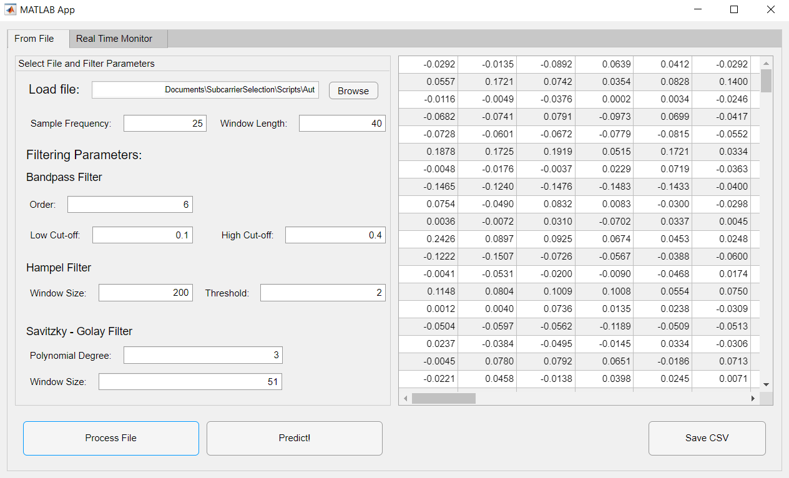

# WiFi-CSI-MiningTool
Scripts and datasets for mining Wi-Fi CSI mainly for breathing rate monitoring but it can be customized and extended for any other CSI-based application.

## Purpose
The scripts and datasets presented in this repository have the purpose of being a tool for the scientific community specialized in the development or investigation of Wi-Fi CSI-based sensing applications by providing a MATLAB app for CSI data processing collected using the [Linux 802.11n CSI Tool](https://dl.acm.org/doi/10.1145/1925861.1925870).

## What You Will Find
* MATLAB scripts and app for processing CSI data for breathing and heart rate monitoring from files and for monitoring breathing rate using a K-NN trained model.
* A K-NN trained model for breathing rate classification. 
* Class and Deployment diagrams for understanding the composition of the MATLAB app.
* Breathing and heart rate CSI amplitude data from 17 test subjects using the Linux 802.11n CSI Tool at different breathing rates.
* Breathing and heart rate dataset with 161 features and one extra column for ground-truth value.

## How It Works
### The MATLAB App 
The MATLAB app has two operation modes. The first one is *From File* processing, which allows to load either a .dat or .csv file for obtaining the CSI Amplitude (for loading a .csv file correctly, it must only have CSI amplitude data) from files generated by using the Linux 802.11n CSI Tool in Wi-Fi devices (for tool installation please visit [Installation Instructions](https://dhalperi.github.io/linux-80211n-csitool/installation.html) by Halperin et al. ). At the same time, filter parameters can be changed in order to allow experimentation. These filters and parameters are:  
* **Bandpass Filter:** filter order and cut-off frequencies. 
* **Hampel Filter:** window size and threshold. 
* **Savitzky-Golay Filter:** polynomial degree and window size.

Once *Process File* button is clicked, file will be processed and time and frequency domain features will be extracted for building breathing or heart rate observations that will be shown in screen in table format. This table can be exported to a CSV file that will be located in the same directory where the MATLAB app is located. *Predict!* button will also become available. This button opens a file explorer and allows to load a classification model exported from [Classification Learner MATLAB App](https://la.mathworks.com/help/stats/classificationlearner-app.html), classifying each observation shown in the table according to the loaded model, adding another column to the table that corresponds to the model response. This table with the column added can be also exported.  

**NOTES:** 
* Before processing the file, please specify the packet rate defined for the Wi-Fi devices packet sending (sample frequency) and the window length of data to use (in seconds, this for applying FFT to data and frequency-domain feature extraction).
* It is highly recommended to use exported csv files created with this operation mode for creating the classification model in order to guarantee compatibility.  

The other operation mode is *Real-Time Monitor*. This operation mode presents an example of how a real-time CSI-based sensing application could be providing information about the current breathing rate of a person. It operates using a plugin developed by [Bingxian et al.](https://ieeexplore.ieee.org/document/7732975) that allows to log CSI data to a server instead of to a file, applying the processing steps as data comes by as well as breathing classification using the model that can be found in Scripts directory. Please take a look at their [repository](https://github.com/lubingxian/Realtime-processing-for-csitool) for instructions of how to execute their scripts on the Wi-Fi devices. 

### Feature Extraction and Classification Model
As mentioned before, time and frequency domain features are extracted from CSI amplitude for creating an observation with a total of 161 features.  This features and their order in the presented table are: 
* Columns 1-10: standard deviation of Level 1 Discrete Wavelet Transform detail coefficients.
* Columns 11-20: standard deviation of Level 2 Discrete Wavelet Transform detail coefficients.
* Columns 21-30: standard deviation of Level 3 Discrete Wavelet Transform detail coefficients.
* Columns 31-40: standard deviation of Level 4 Discrete Wavelet Transfrom detail coefficients.
* Columns 41-50: mean of Level 1 Discrete Wavelet Transform detail coefficients.
* Columns 51-60: mean of Level 2 Discrete Wavelet Transform detail coefficients.
* Columns 61-70: mean of Level 3 Discrete Wavelet Transform detail coefficients.
* Columns 71-80: mean of Level 4 Discrete Wavelet Transform detail coefficients.
* Columns 81-90: mean of Discrete Wavelet Transform approximation coefficients.
* Columns 91-100: variance of Discrete Wavelet Transform approximation coefficients.
* Columns 101-110: 
mean of subcarriers' amplitude. 
* Columns 111-120: variance of subcarriers' amplitude.
* Columns 121-130: kurtosis of subcarriers' amplitude.
* Columns 131-140: skewness of subcarriers' amplitude.
* Columns 141-150: frequency with highest magnitude for each subcarrier.
* Columns 151-160: standard deviation of frequency spectrum.
* Column 161: breathing rate estimation based on frequency analysis.  

The K-NN classification model found in this repository follows this same structure as model training was done with data exported from this app. 

**NOTES:**
* Only CSI amplitude of 10 subcarriers are used for reducing computational complexity and for improving the classification performance by only using subcarriers with relevant information.

## Contact 
**Jesus A. Armenta-Garcia**  
Email: albany.armenta@uabc.edu.mx

**Felix F. Gonzalez-Navarro**  
Email: fernando.gonzalez@uabc.edu.mx
